# Project 2 (NEX)

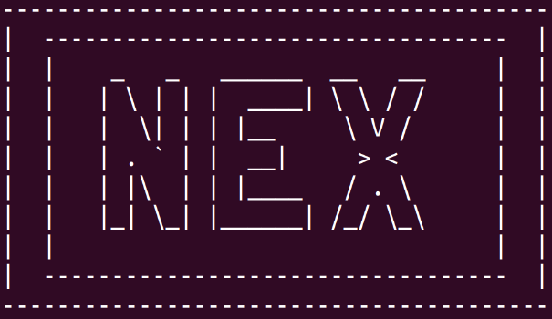

## Game and Group Identification

2nd project done during the Functional and Logic Programming curricular unit. The NEX boardgame.

#### Project made by group T12_Nex6 :
- Gonçalo Jorge Soares Ferreira - up202004761
- Pedro Nuno Ferreira Moura de Macedo - up202007531

#### Contributions:
- Gonçalo - 50%
- Pedro - 50%

## Execution
In order to run the program you only need to compile the game.pl file and run 'play'.

## Game Description

### Overview
 - Nex is a board game which is a variant of the Hex game invented by Pedro Neto in 2004.
### Board

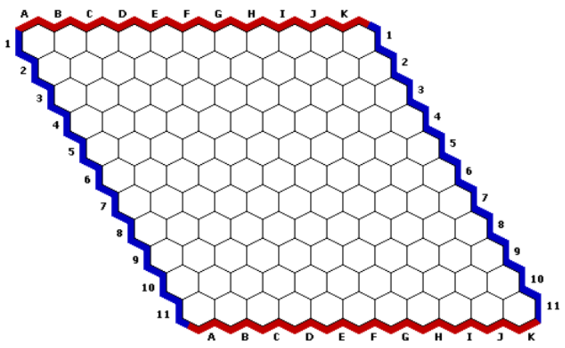

 - Nex is played on a rhombus board of different sizes. Pairs of the opposite board edges are marked with two colors, Red and Blue.
### Objective
 - The objective of Nex is to create a connected chain of a player's stones linking the opposite edges of the board marked by the player's color.
### Play
 - The game begins with an empty board.

 - Each player has an allocated color, Red and Blue.

 - Players take turns making one of the following:

    1. Place a stone of their color AND a neutral stone on empty cells;
    2. Replace two neutral stones with stones of their color, AND replace a different stone of their color on the board to neutral stone.

- Since the first player has a distinct advantage, the pie rule is generally used to make the game fair.  This rule allows the second player to switch colors as his first move.
### Game page
(https://www.iggamecenter.com/en/rules/nex)

## Game Logic

### Internal Representation of the Game State

Our board is represented as a list of lists that varies in size according to the input size of the board entered by the user.

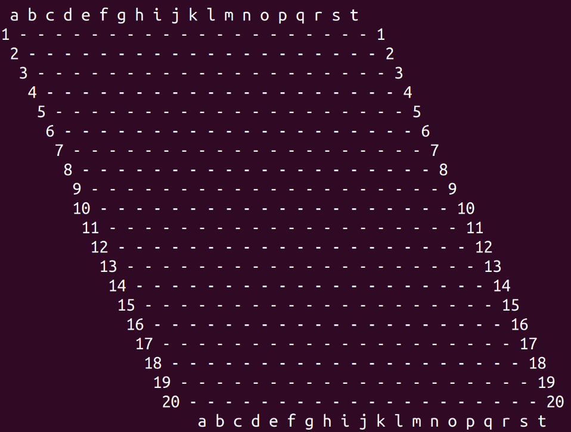

We used the predicate <i>dynamic/1</i> to store the current board state and the current player taking a turn (<i>board/1</i>, <i>player/1</i>).

The <i>player/1</i> changes between 'o' and 'x' after every play, so we can store who is taking a turn, to know who plays next.

### Game State View

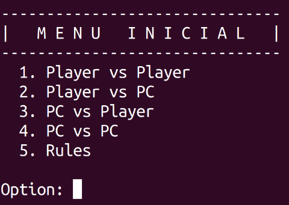

When starting the game, its name will show up in big letters along with an Initial Menu with 5 options :
1. Player vs Player
2. Player vs PC
3. PC vs Player
4. PC vs PC
5. Rules

In this Menu you choose the type of game you want. Also you can press option 5 and see the Game Rules.

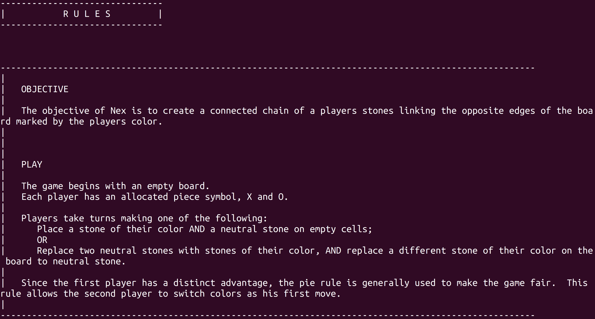

After this Menu, if you chose any of modes which have the PC involved you will be faced with another Menu asking the difficulty of the PC:
1. Easy
2. Difficult

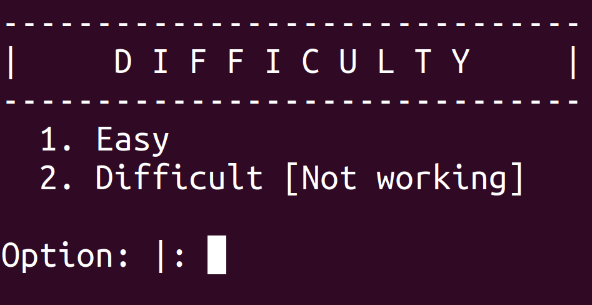

The first option makes the bot play a random move. The second option (which was not implemented would make the bot play the best move in the moment to win).

Following this the User will be asked to input the size of the board in which he wants to play (between 1-26).

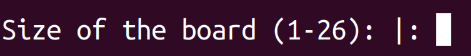

The game then starts printing an empty board and the options to make a move:
1. Place a stone of their color AND a neutral stone on empty cells
2. Replace two neutral stones with stones of their color, AND replace a different stone of their color on the board to neutral stone

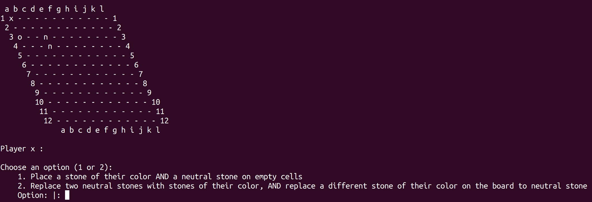

The user is then asked to input the coordinates, row and column, of each stone he has to play according to the chosen option.

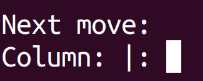

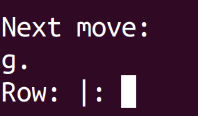

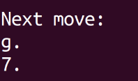

After that, the new board with the stones placed above is printed, and the turn switches to the other player.

In all the previously mentioned Menus, if the User inputs an invalid option he will be asked to enter a new input again until a correct one is selected. 

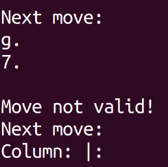

### Execution of Moves 

When picking out a move, before placing it on the board we check if it's a valid move. First of, we make sure the coordinates are in the range of the board. Afterwards, we check if the play is valid according to the rules depending on the play option the user chose.

If the user chose the option 1, we verify if both the coordinates of the color stone and the neutral stone are empty so that a piece can be placed.

On the other hand, if option 2 was selected is checked that there are at least two neutral stones and a stone of their symbol on the board.

Also, if the board is full, no stone can be placed and it ends as a draw.

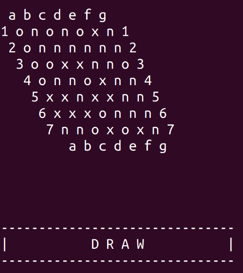

### End Game

For a player to win the game he has to make a connected chain of stones of his color linking the opposite edges of the board. The 'x' player has to make it from the left side to the right or vice-versa, while the 'o' player has to make it from north to south or vice-versa.

Player x wins:

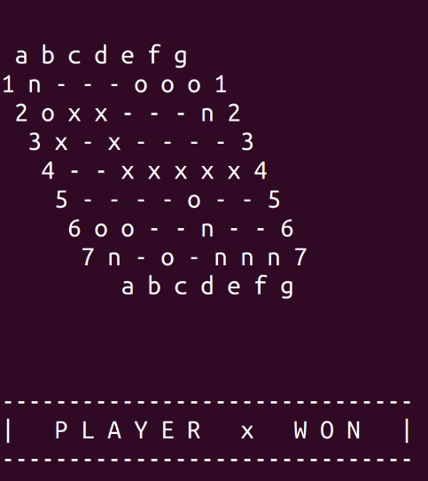

Player o wins:

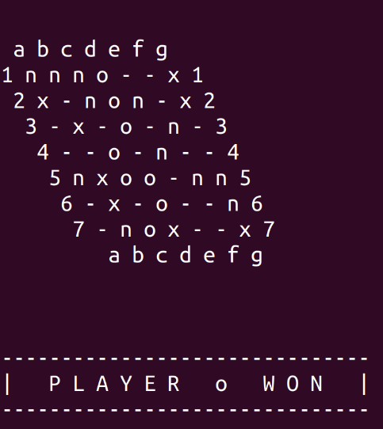

In order to control if there is a connected chain we used a DFS (Depth-first search). The algorithm starts at one piece of the first column and goes as far as it can down a given path, then backtracks until it finds an unexplored path, and then explores it. If it reaches the last column, than player 'x' has won. It does the same starting from the first row. If it reaches the last row player 'o' wins.

The verification is done after every play.

### Computer Moves

The computer has two difficulties, Easy and Difficult, however we could only implement the easy mode, because we don't know what's best move in the moment.

On the Easy Mode, the computer picks a random row and column to play. After that, and only if the move is valid the PC makes its play.

## Conclusion

In conclusion, the development of this project was mostly challenging.

Our team did its best and worked tirelessly to try to recreate the finest Nex board game in prolog.

The most arduous task was definitely creating the second level of the AI. Unfortunately we weren't able to do it successfully.

## Bibliography

(https://www.swi-prolog.org/)

(https://www.iggamecenter.com/en/rules/nex)
